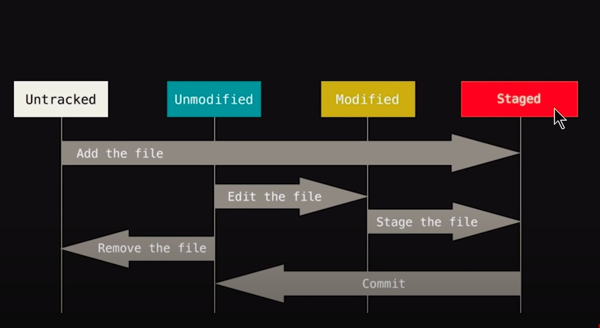

## Git Essentials
[What is git ?](#what-is-git)

[Tracking changes with git](#1-tracking-changes-with-git)

&nbsp; &nbsp; &nbsp; [Git configuration](#git-user-configurations)

&nbsp; &nbsp; &nbsp; [Git init](#deploy-git-in-a-repository) 

&nbsp; &nbsp; &nbsp; [Working of git](#working-of-git)

&nbsp; &nbsp; &nbsp; [Add files to  stagging area](#adding-files-to-the-stagging-area)

&nbsp; &nbsp; &nbsp; [Remove from stagging area](#removing-from-stagging-area)

&nbsp; &nbsp; &nbsp; [git ignore](#ignoring-files-from-tracking)

&nbsp; &nbsp; &nbsp; [Check the differences in files](#check-the-differences)

&nbsp; &nbsp; &nbsp; [Git stash](#git-stash)

&nbsp; &nbsp; &nbsp;  [Commit the changes](#git-commit)


### What is git
Git is a version control software that tracks changes in the files in a codebase or project repository.

- Git stores and manages multiple versions of a project's files, allowing developers to revert back to previous versions if necessary. 
- It also supports parallel developement, which means that multiple people can work on different versions of the project's files (by creating different branches) and merge their changes together.

### 1. Tracking changes with git

### Git user configurations
Basically git is a software, so as a user of it we need to configure with our credentials like name, email etc.

Git configurations can be done in 3 levels, (priority wise shown below)

```--local ``` (default) --> Configurations are applied to the particular repository only.


```--global ```--> Applied to any repository where git is initialized, but only for a particular user of the operating system.

```--system ```--> Applied to any repository where git is initialized and for all users of the operating system.

Example: Global level user configuration
```
git config --global user.name "My name"

git config --global user.email "myemail_id@email.com"
```
Once configured check the configurations
```
git config -l
```
To change the user configuration
```
git config --edit --global
```

Moreover there are other options to configure the git facilities like core-editor, merge tools, color outputs and aliases to git commands.

[Know more about git configurations](https://www.atlassian.com/git/tutorials/setting-up-a-repository/git-config)

### Deploy git in a repository

In order to track the changes in a project repository we need to deploy git in that particular repository.

``` git init ```  --> To initialize git in a working repository.

- Normally the project repository is called an working repository and once git is initialized it is called a git repo/local git repository

### Working of git



- A new file just added to the working_dir --> it is in untracked (```U```) mode. Untracked files are shown in red color on typing 'git status'.

- Then the file is added to the stagging area. In the stagging area all the added files (completely new or those that were stagged before) are shown in green color.

- Then they are committed. 

- Once committed, the files are out of stagging area but in tracking zone, in static (unmodified) mode.

- Now git will track any change to those files present in tracking zone. If we do any modification on the files in tracking zone,they are marked as modified (```M```) but we can't commit tehm directly.

- To commit we need to add them again to the stagging area and now, files are in the stagging area and so we can commit.

**Note:** 

Lets say a file is modified and then added to the stagging area, but not committed. At this situation if the file is modified again, it gets out of the stagging area and again we need to add it to the stagging area.


### Know the status at any time

```git status``` --> Full status

```git status -s ``` --> Short status in M, D form.

### Adding files to the stagging area

```git add file1.py``` --> Stages a single file

``` git add file1.py file2.sh``` --> Stages multiple files

```git add *.sh``` --> Stages all files with a  common pattern

```git add . ``` --> Stages the current directory and all its content

### Removing from stagging area
Lets say some files are added to the stagging area by mistake now we want to remove them from stagging area.

``` git restore --staged file1.js``` --> Remove from stagging area, but keep tracking.

```git rm --cached file1.js``` --> Remove from staging area and also stop tracking it.

``` git rm file1.js ``` --> Removes from staging area and deletes the file from working repository also.

### Ignoring files from tracking
Lets say there are some files or directories in the working directory and we don't want to track changes on them, so we can ignore them by creating a gitignore file.

A ```.gitignore``` file is a plain text file that contains a list of all the specified files and folders from the project that Git should ignore and not track.

- First create a ```.gitignore``` file. It is like a normal text file.
- Add the files name or directory path (relative path from the present working directory) that we want to be ignored. 

After that if we add all files by "git add .", files in the ignore list will not be added.

If the files are already added to the tracking zone or stagging area we can remove them using the command 

```
git rm --cached file1.js file2.java
```

### Check the differences 
Viewing the staged/unstaged changes

```git diff``` --> Shows unstaged changes

```git diff --staged``` Shows staged changes

```git diff --cached``` --> Same as the above

### Git stash
Git stash is a way to  save the uncommitted changes (both staged and unstaged) temporarily and revert back later when we need. 
- Git stash is used when we need to do something else in between a project modification,  so we can work on something else, and then come back and re-apply changes later on. 
- Or, we have done some modifications but not quite ready to commit.

```git stash ``` --> Creates a new stash, with a message from the last commit.

```git stash list```  --> Lists all the stashes

``` git stash show stash@{1} ```-->Shows the given stash

``` git stash show 1``` --> shortcut for stash@{1}

``` git stash apply ``` --> Applies all the stashes to the working directory but does not remove the stashes from the list.

``` git stash apply 1 ``` --> Applies the specified stash to the working dir but does not remove the stash from the list.

``` git stash pop ``` --> Applies back the latest stash@{0} to the working directory and removes the stash from the list.

``` git stash drop 1```  --> Deletes the given stash

``` git stash clear ``` -->  Deletes all the stashes


### Git Commit

### Check History


### 2. Local to Remote repo in Github

### 3. Collaboration using git